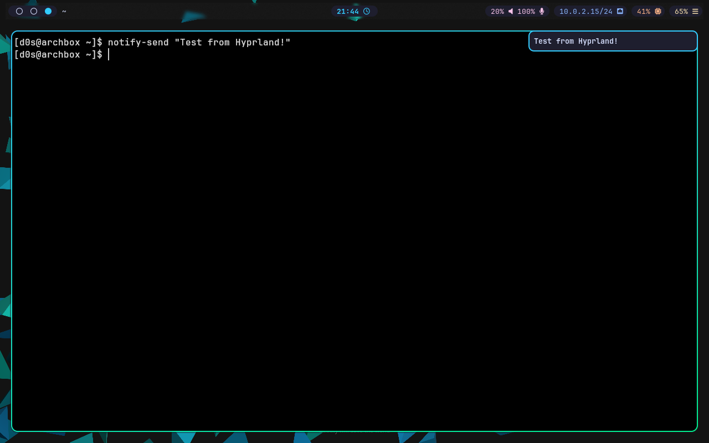

# 🌌 Arch Linux + Hyprland Dotfiles

Configuración personal minimalista y altamente funcional para **Arch Linux** con **Hyprland**. Enfocada en productividad, estética oscura y automatización.



## 🚀 Instalación rápida

```bash
git clone https://github.com/ejsalasdev/dotfiles.git ~/dotfiles
cd ~/dotfiles
chmod +x install.sh
./install.sh
```

## 🧩 Componentes Principales

*   **WM:** Hyprland (Wayland)
*   **Terminal:** Kitty
*   **Barra:** Waybar (con soporte para batería, bluetooth, etc.)
*   **Lanzador:** Wofi
*   **Utilidades:** Thunar, Viewnior, BlueTUI, Cliphist, Hyprlock/Hypridle.
*   **Estilo:** Adwaita Dark + Papirus Icons + Nerd Fonts.

## ⌨️ Atajos Clave (Keybindings)

| Atajo | Acción |
|-------|--------|
| `SUPER + RETURN` | Terminal |
| `SUPER + SPACE` | Lanzador de Apps |
| `SUPER + E` | Archivos (Thunar) |
| `SUPER + Q` | Cerrar ventana |
| `SUPER + SHIFT + Q` | **Cerrar Sesión** (Logout) |
| `SUPER + SHIFT + R` | Recargar Hyprland |
| `SUPER + V` | **Historial Portapapeles** |
| `SUPER + R` | **Modo Resize** (Flechas para ajustar, ESC para salir) |
| `SUPER + Flechas` | Mover Foco |
| `SUPER + SHIFT + Flechas` | Mover Ventana |
| `SUPER + SHIFT + SPACE` | Flotar Ventana |
| `SUPER + L` | Bloquear Pantalla |

> **Nota:** El setup está optimizado para **Doble Monitor** (Monitor externo a la izquierda como principal, Laptop a la derecha como secundaria).